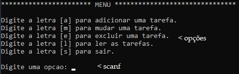
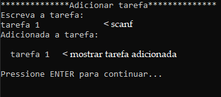
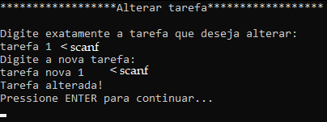
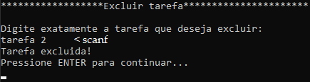
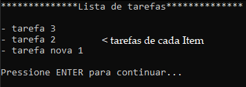

# Estrutura `Item`

A estrutura (classe) `Item` representa um item (nó) de uma lista encadeada.  
Cada elemento contém uma tarefa (string) e um ponteiro para o próximo elemento da lista.

```c
struct Item {
    char tarefa[50];
    struct Item *prox;
};
```

### Variáveis

-   **array de char:`tarefa[50]`**  
    Armazena a tarefa com até 49 caracteres mais o `\0`.  
    
-   **ponteiro: `prox`**  
    Ponteiro para o próximo elemento da lista.
    
    -  Se `prox != NULL`, o Item aponta para outro nó válido.
        
    -    Se `prox == NULL`, significa que este é o último Item da lista.
        
   
    

### Apelido com `typedef`

```c 
typedef struct Item Item;
```

Permite usar `Item` ao invés de `struct Item`, tornando o código mais limpo e legível.

#  Funções

##  `Item* criarItem(char *texto)`

**Cria um novo item da lista.**


- Usa `malloc` para alocar memória.
    
- Copia o texto recebido pelo `scanf` para o campo `tarefa`.
    
- Define `prox = NULL`.
    
- Retorna o ponteiro para o novo item.
    


##  `void limpar()`

**Limpa o terminal dependendo do sistema operacional.**

- Usa `#ifdef` (checa se existe uma constante) para ver se **_WIN32** está definida.

- No Windows: executa `system(cls)`
    
- Em Linux/Mac: executa `system(clear)`
    


##  `void imprimirLista(Item *lista)`

**Exibe todas as tarefas da lista.**

- Percorre a lista com um ponteiro auxiliar.
    
-  Exibe cada tarefa com um traço.
    
- Se a lista estiver vazia, imprime mensagem adequada.
    

##  `void adicionar(Item **lista)`

**Adiciona uma nova tarefa no início da lista.**


- Lê a tarefa via `fgets` (aceita espaços).
    
- Remove o `\n` final.
    
- Cria um novo item com `criarItem()`.
    
- Insere a tarefa digitada no começo da lista encadeada.

##  `void alterar(Item *lista)`

**Altera o texto de uma tarefa existente.**

- Lê a tarefa digitada.
    
- Percorre a lista, se encontrar a tarefa:
    
    - Lê uma nova tarefa.
    - Substitui a string antiga pela nova.
       


##  `void excluir(Item **lista)`

**Exclui uma tarefa existente da lista.**


-   Lê o nome da tarefa a excluir.
    
-   Percorre a lista, se encontrar a tarefa:

    
    -   Ajusta ponteiros conforme for início, meio ou fim.
        
    -   Deleta o Item e libera memória com `free`.
        


#  Função Principal — `main()`
**Função onde está o menu principal.**

-   Cria a lista vazia: `Item *lista = NULL`.
    
-   Exibe o menu, se o usuário digitar `s` de *sair* ele fecha o programa.
    
-   Usa `scanf` para ler a opção, com `getchar()` para limpar o ENTER a mais que sobra no buffer.
    
-   Chama funções conforme a escolha:
    
    -   `a` → adicionar( )
        
    -   `m` → alterar( )
        
    -   `e` → excluir( )
        
    -   `l` → listar( )
        
    -   `s` → sair (sai do `while`)
        
-   Caso opção inválida, exibe uma mensagem e roda o `while` de novo.
    

# Resumo de Fluxo

MENU ├── a → `adicionar()` → volta ao menu 
MENU ├── m → `alterar()` → volta ao menu 
MENU ├── e → `excluir()` → volta ao menu 
MENU ├── l → `imprimirLista()` → volta ao menu 
MENU └── s → encerra programa

----------

#  Observações Importantes

-   Todas as tarefas são armazenadas em uma **lista encadeada**.
    
-   Para controle de uso de memória, `malloc` é usado para cada item, e `free` para excluir.
    
-   Entrada das tarefas com `fgets` usa o arquivo `stdin` e evita problemas de espaços.

# Telas do programa

## Tela do menu
   

## Tela da função `adicionar()` 


## Tela da função `alterar()` 


caso o usuário escreva um nome diferente será printado `Tarefa nao encontrada.` .

## Tela da função `excluir()` 


caso o usuário escreva um nome diferente será printado `Tarefa nao encontrada.` .

## Tela da função `imprimirLista()` 
 

caso a lista de tarefas esteja vazia será printado `Nenhuma tarefa para fazer!` .